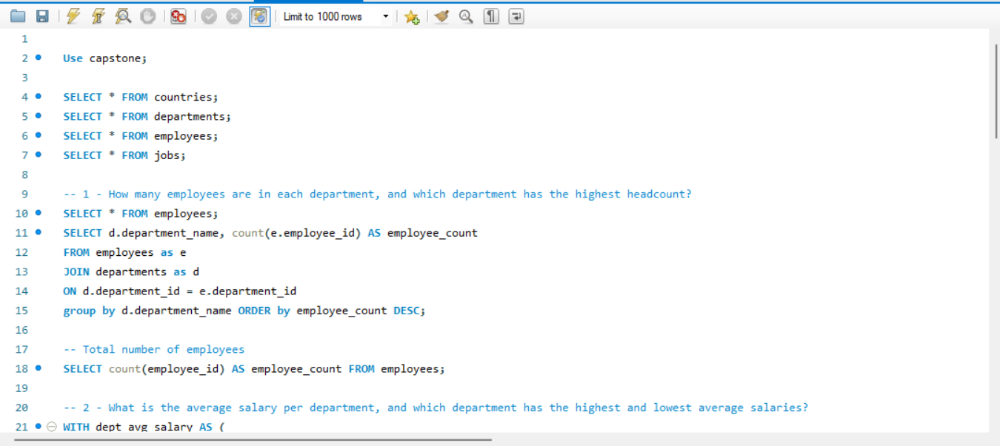

## Orion Data Systems HR Data
Analysis of the workforce database to support Management decision-making.

## Dashboard

## Executive Summary
- Orion Data Systems requires analysis that’ll enable them to make accurate data-driven decisions for their business.
- Developed an SQL schema comprising workforce data sets (employees, departments, jobs, countries). 

## Business Problem
Orion Data Systems is a multinational consulting and technology firm with offices across Europe, Asia, and the Americas. The company employs lots of professionals across multiple departments and job roles. As a result, insights from their workforce database to support data-driven decision-making.

## Process and Methodology
## Tools Used: 
MySQL Workbench

## Data Sourcing & Overview
## The dataset consists of ; 
- 11 columns in employees data (employee_id, emp_name, email, phone_number, hire_date, job_id, salary, commission_pct, manager_name, department_id, country_id)
- 4 columns in departments data (department_id, department_name, manager_id, location_id)
- 4 columns in jobs data (job_id, job_title, min_salary, max_salary)
- 3 columns in countries data (country_id, country_name, region) 

## Analysis and Insights
This section breaks down the data into actionable insights

## Number of employees in each department, and the department with the highest headcount
- Shipping department has the highest number (45) of employees accounting 42% of the total number(107) of employees.
- Sales department with 34 employees and Shipping department constitute 74% of the whole workforce

## Average salary per department, and the departments with the highest and lowest average salaries
Executive department has the highest average salary, while Shipping has the lowest

## Recommendations-
- Consider reviewing the salaries of employees in the Shipping department 
- Also, within the Shipping and Sales departments, there should be a review of current business processes in conjunction with job descriptions to ensure that resources are being efficiently utilized

